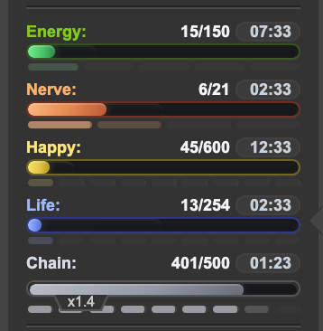

# Torn Userscripts

Userscripts for [Torn](https://www.torn.com/) with a strict rules-first approach.

This repository is intentionally conservative. Scripts here are designed to stay within Torn's published scripting and API boundaries.

## Scripts

### Torn Vital Bars Polish

A focused userscript that improves the visible `Energy`, `Nerve`, `Happy`, `Life`, and `Chain` bars in Torn's sidebar while keeping the original layout and information structure intact.

What it does:

- Refines the visible vital bars only
- Keeps Torn's native sidebar density and structure
- Adds cleaner fills, restrained timer chips, and optional ticks
- Includes a local toggle for ticks on or off via the userscript menu

What it does not do:

- No automation
- No extra Torn page requests
- No hidden-page behavior
- No invented gameplay data

Install:

- Direct install: [torn-vital-bars-polish.user.js](https://raw.githubusercontent.com/phantium/torn-userscripts/main/torn-vital-bars-polish/torn-vital-bars-polish.user.js)
- GitHub source: [torn-vital-bars-polish](https://github.com/phantium/torn-userscripts/tree/main/torn-vital-bars-polish)

Because the script includes `@downloadURL` and `@updateURL` metadata pointing at GitHub raw content, Tampermonkey or Violentmonkey can update it from this repository when new versions are published.

## Repository Layout

- [torn-vital-bars-polish](/Users/dominique/Projects/torn_addons/torn-vital-bars-polish): current userscript and previews

