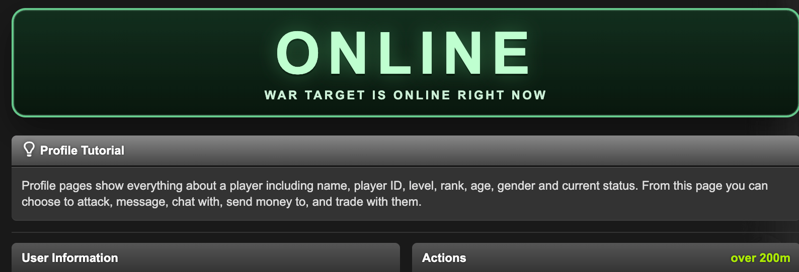

# Faction War Profile Status Banner

This folder contains a profile-page userscript that shows a large `ONLINE` banner only when the viewed player is both:

- visibly `online` on the current profile page
- in a currently active war against your faction

## Preview

## Install

- Direct install: [faction-war-profile-status-banner.user.js](https://raw.githubusercontent.com/phantium/torn-userscripts/main/faction-war-profile-status-banner/faction-war-profile-status-banner.user.js)
- GitHub source: [faction-war-profile-status-banner](https://github.com/phantium/torn-userscripts/tree/main/faction-war-profile-status-banner)
- After installing, open a Torn profile page. If no API key is set yet, the page will show an inline setup panel where you can paste and save the key locally.
- A `Public Only` API key is sufficient for this script because it only needs `faction -> basic`.

## Scope

The script stays intentionally narrow:

- Profile page only
- Reads the visible profile status from the page
- Uses the official Torn API only to identify your faction's active war opponents
- Stores the API key locally in the browser only
- No automation
- No non-API Torn requests
- No hidden-page collection

## What It Changes

- Detects `online`, `idle`, or `offline` from the visible profile page
- Reads your faction's current war opponents through Torn's official API
- Matches the viewed profile by visible faction name on the page
- Shows a bold `ONLINE` banner only when both conditions match
- Stays quiet for non-war profiles, `idle`, and `offline`

## API Use

- Endpoint used: `faction/?selections=basic`
- Required selections: `faction -> basic`
- Supported key scope: `Public Only`
- Key storage: local userscript storage only
- Data sharing: none

## Notes

Torn's DOM can change over time, so the script reads the visible profile page for both the online indicator and the visible faction name. The API is only used to cache the factions currently at war with yours, and those cached faction names are compared against the visible profile.

The API call is used only to cache active war opponents. It does not automate attacks, navigation, refreshing, or any gameplay actions.
